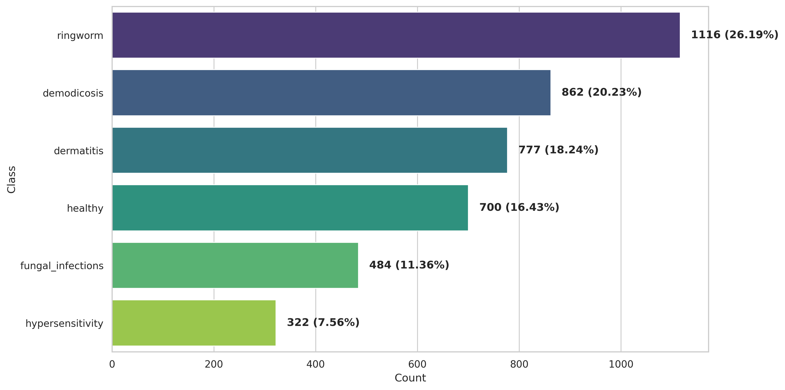
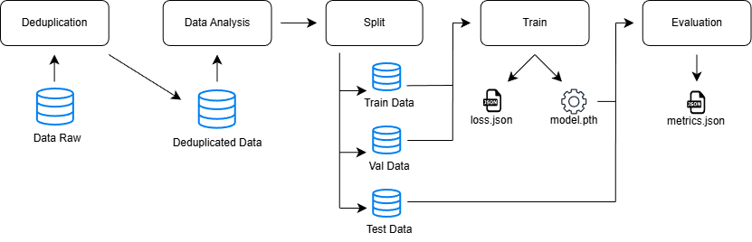
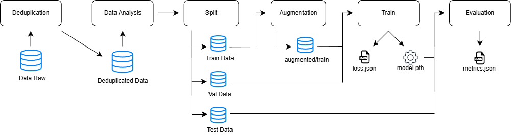
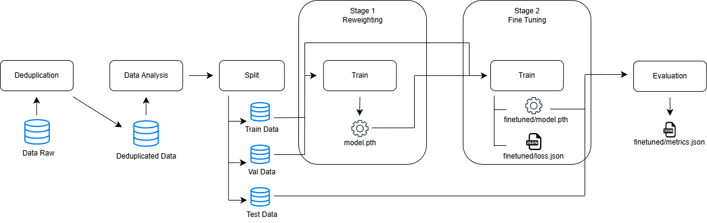
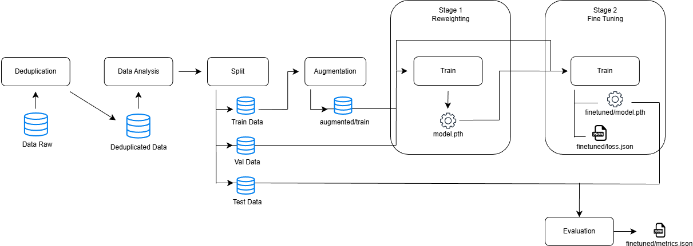
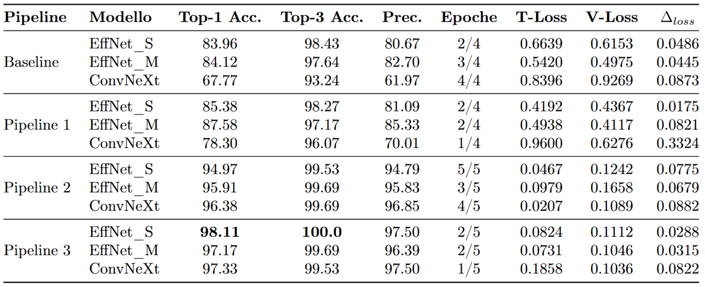

# SkinDetector
SkinDetector is a deep-learning AI module capable of diagnosing canine dermatological diseases by observing an image of your dog's skin.

SkinDetector is part of the [SafePet project](https://github.com/Progetto-SafePet).

## AUTHORS
Simone Cimmino [@SimoCimmi](https://github.com/SimoCimmi)  
Luca Salvatore [@lucasalvaa](https://github.com/lucasalvaa)  
Morgan Vitiello [@MorganVitiello](https://github.com/MorganVitiello)

## CREDITS
The project was developed at the University of Salerno, Department of Computer Science, in the academic year 2025-26 for
the exam of Fundamentals of Artificial Intelligence helb by Professor Fabio Palomba [@fpalomba](https://github.com/fpalomba), whom we thank for his support.

## DATASET
The dataset on which the models were trained is [Dog's skin diseases (Image Dataset)](https://www.kaggle.com/datasets/youssefmohmmed/dogs-skin-diseases-image-dataset).

## TRAINING PIPELINES
To select the final model, four slightly different training pipelines were undertaken. Each pipeline is defined in the experiments/[pipeline] directory in the relative dvc.yaml file.

### Baseline
The training will be performed on the starting dataset without duplicates.

### Data Augmentation (Pipeline 1)
Model training will be performed after creating synthetic samples to increase 
the size of the dataset. We selected four techniques to increase the image volume of the training set:
horizontal flipping, vertical flipping, noise injection, and saturation enhancement. Of these four,
only two techniques will be applied to each image in the initial training set, according to a
randomized criterion. After the data augmentation phase, the size of the training set 
will be tripled.

### Two-Stage Fine-Tuning (Pipeline 2)
This approach, formalized by [ValizadehAslani et al.](https://arxiv.org/abs/2207.10858), is designed to address the
class-imbalance problem of the training set. Unlike standard fine-tuning,
which often causes the model to ignore minority classes in favor of majority classes,
this technique divides the learning process into two distinct phases.
In the first phase, only the last layer of the model is trained, freezing all other backbone layers. 
The weighted loss function [LDAM Loss](https://arxiv.org/abs/1906.07413) is used, which assigns larger margins to minority classes, 
forcing the classifier to minimize the error on them despite the sparseness of samples.
In the second phase, fine-tuning is performed by unfreezing all model layers and using the traditional Cross-Entropy loss function.

### Data Augmentation + Two-Stage Fine-Tuning (Pipeline 3)
We combine the data augmentation strategy of Pipeline 1 with the two-stage fine-tuning strategy of Pipeline 2.

## RESULTS

The table shows the results of the experiments. The final model chosen is EfficientNetV2_S trained in Pipeline 3.

